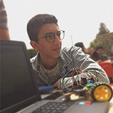

# Boys documentations

## Name: Mohamed Ahmed Roshdy

## Grade: 11

## Category: Organization Committee 

# School: Menofia STEM School

## Name: Mohamed Ashraf Hasabo

## Grade: 11

## Category: Graphic Design

## School: Menofia STEM School

## Name: Abdelrahman Waleed Mohamed

## Grade: 11

## Category: Organization Committee

## School: Menofia STEM School 

## Name: Zeyad Khaled El Gameel

## Grade: 11

## Category: Organization Committee

## School: Menofia STEM School 

## Name: Mohamed Atef Balata

## Grade: 11

## Category: Organization Committee

## School: Menofia STEM School 

## Name: Mahmoud Sabry Abdallah

## Grade: 11

## Category: Electronics 

## School: Menofia STEM School 

## Name: Abdullah Mohammed Mumtaz Olimy

## Grade: 11

## Category:  Electronics & Arduino - 3D design

## School: Menofia STEM School

## Name: Makram Ali Elbarbary

## Grade: 11

## Category: Python Committee

## School: Menofia STEM School 

## Name: Zeyad Emad Abddelhamid Tahoon

## Grade: 11

## Category: Graphic Design

## School: Menofia STEM School 

## Name: Zeyad Mamdouh Ebrahim

## Grade: 11

## Category: Graphic Design

## School: Menofia STEM School 

[Go back to readme file](README.md)