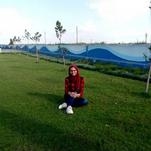
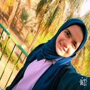
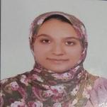
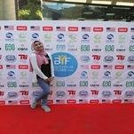
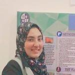

# Grils documentations

## Name: Marwa Reda Abdl-aziz

## Grade: 11

## Category: Organization Committee 

# School: Menofia STEM School

## Name: Sondos Essam Jafaar

## Grade: 11

## ategory: Electronics

## School: Menofia STEM School

## Name: Nada Samir Jibril

## Grade: 11

## Category: Python

## School: Menofia STEM School 

## Name:  shimaa Abed ElHadi Mohammed

## Grade: 11

## Category: Graphic

## School: Menofia STEM School 

## Name: Menna Tarek Fathallah

## Grade: 11

## Category: Organization Committee

## School: Menofia STEM School 

## Name: Rawan Mostafa Mahmoud

## Grade: 11

## Category: Organization Committee 

## School: Menofia STEM School 

## Name: Esraa samir Abdelmonsif
## Grade: 11

## Category: Organization Committee 

## School: Menofia STEM School

## Name: Menna Saad

## Grade: 11

## Category: Electronic 

## School: Menofia STEM School 

## Name:  Alzahraa Saber Almahmoudy

## Grade: 11

## Category: rganization Committee 

## School: Menofia STEM School 

## Name: Maisoon Magdy Shaalan.

## Grade: 11

## Category: Electronics.

## School: Menofia STEM School 

## Name: Salma Ahmed kassap daba

## Grade: 11

## Category: Graphic

## School: Menofia STEM School 

## Name: Farah Osama

## Grade: 11

## Category: Pythom

## School: Menofia STEM School 

[Go back to readme file](README.md)