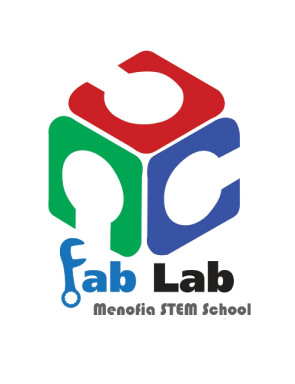

# FabLab.Team.io
  
# Welcome fab lab menofia 
Welcome to fab lab menofia Stem school  repository, this is created document the training contents, it is 7 weeks training, we trained at stem school.
# About me

My name is shokry gorge , i am a fab lab manager at menofia stem school, it is a secondary school, i have been there for about two years, i am responsible of helping students at their projects using the available machines and tools.

# FabLab Team 
- # 1- [Boys documentations](Boys.md)

- # 2- [Girls documentations](Girls.md)

# Tables of contents training

 # 1. [Electronics](Electronics.md)

# 2. [Python](Python.md)

# 3. [Design](Design.md)

# 4. [Learning Machine"fablab team"](learning.md)

## References

mail : 

shokry.eshak@stemmenof.moe.edu.eg

shokry29@gmail.com

Github :

https://github.com/

Fablabs : 

https://fablabs.io/users/shokry

Facebook :

https://www.facebook.com/groups/247769755891334/
# FabLab.Team.io
